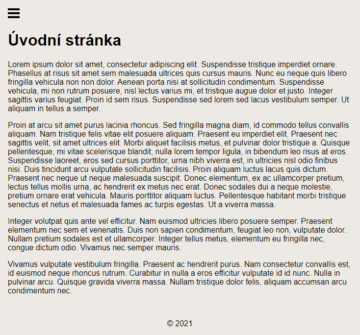
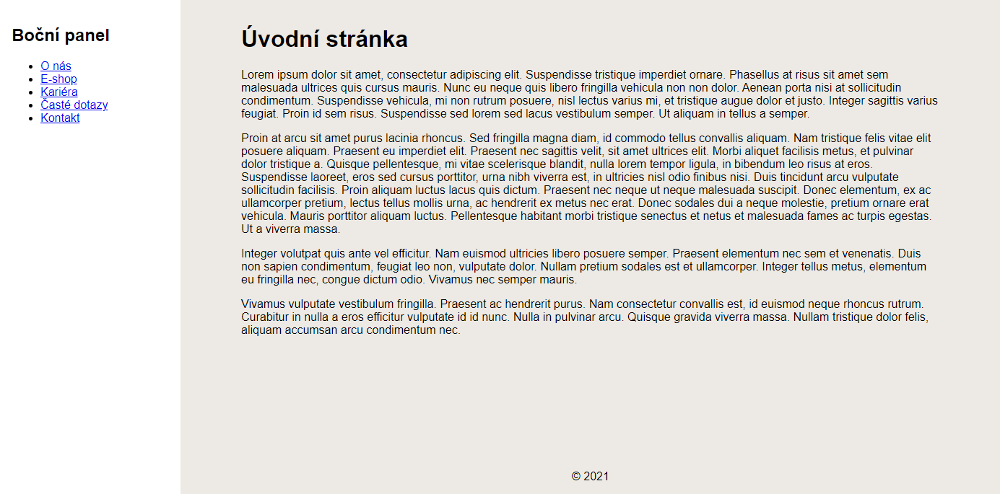

# Cvičení: Boční panel

Tvým úkolem bude rozpohybovat boční panel. Po kliknutí na hamburger tlačítko by se měl vysunout a kliknutím na křížek zase zasunout. Ukázka: [bocni-panel.netlify.app](https://bocni-panel.netlify.app/).

## Zadání

- Spusť si tento projekt postavený na [Eleventy](https://www.11ty.dev/).

  ### Instalace závislostí

  `npm install`

  ### Produkční sestavení

  `npm run build`

  ### Vývojové sestavení

  `npm run dev`

- Koukni do prohlížeče, že se ti stránka při vývojovém sestavení načte.

- Pomocí `position: fixed` roztáhni boční panel přes celou levou stranu.

- Zasuň panel za levou hranu obrazovky tak, aby nebyl vidět (styl `transform: translateX(-100%)`).

- Pokud je checkbox zaškrtnutý (selektor `input:checked ~ .bocniPanel`), vysuň panel (styl `transform: none`).

- Vyzkoušej, že se panel po kliknutí na hamburger tlačítko zobrazí a po kliknutí na křížek zase zmizí.

- Přidej plynulý přechod pomocí `transition: transform 0.3s`.

- Skryj checkbox.

## Bonus

- Na větších obrazovkách skryj tlačítka pro vysouvání a zasouvání.

- Boční panel nech stále zobrazený vedle hlavního obsahu a patičky.

